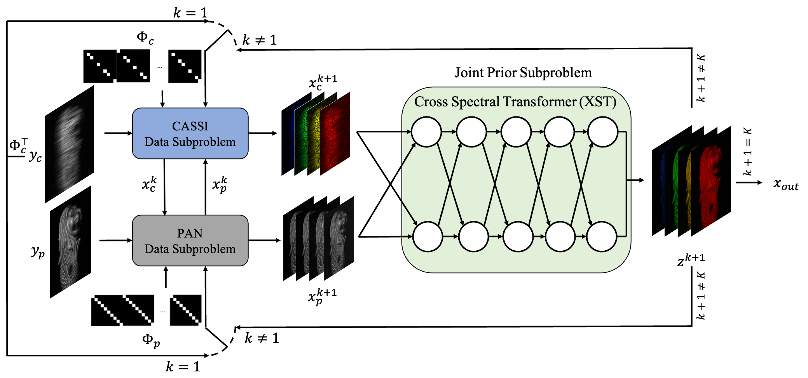

## ADRNN-XST: Alternating Direction Recurrent Neural Network with a Cross Spectral Attention Prior for Dual-Camera Compressive Hyperspectral Imaging

This repo is the implementation of the paper "Alternating Direction Recurrent Neural Network with a Cross Spectral Attention Prior for Dual-Camera Compressive Hyperspectral Imaging".

## Abstract

Coded Aperture Snapshot Spectral Imaging (CASSI) multiplexes 3D Hyperspectral Images (HSIs) into a 2D sensor to capture dynamic spectral scenes, which, however, sacrifices the spatial resolution. Dual-Camera Compressive Hyperspectral Imaging (DCCHI) enhances CASSI by incorporating a Panchromatic (PAN) camera to compensate for the loss of spatial information in CASSI. However, the dual-camera structure of DCCHI disrupts the diagonal property of the product of the sensing matrix and its transpose,  hindering the application of model-based methods and Deep Unfolding Networks (DUNs) that rely on a closed-form solution, thereby compromising their performance. To address this issue, we propose an Alternating Direction DUN, named ADRNN, which decouples the imaging model of DCCHI into a CASSI subproblem and a PAN subproblem. The ADRNN alternately solves data terms analytically and a joint prior term in these subproblems. Additionally, we propose a Cross Spectral Transformer (XST) to exploit the joint prior. The XST effectively models the correlation between the compressed HSI and the PAN image with advanced cross-attention mechanism and Grouped-Query Attention (GQA). Furthermore, we built a prototype DCCHI system and captured large-scale indoor and outdoor scenes for future academic research. Extensive experiments on both simulation and real datasets demonstrate that the proposed method achieves state-of-the-art (SOTA) performance.

## Architecture

<div align=center>

</div>

The proposed method is formulated as a nested optimization problem, consisting of an outer optimization loop that alternates between solving the CASSI subproblem and the PAN subproblem. Both subproblems are solved using optimization techniques and share a joint prior. To simplify the process, the inner optimization iteration is set to 1, transforming the proposed method  into an alternating solution approach for the CASSI data subproblem, the PAN data subproblem, and the joint prior subproblem.

By unfolding the proposed optimization method into a DUN and convert the DUN into an RNN by sharing parameters across stages, the proposed ADRNN is obtained. Furthermore, we propose a Cross  Spectral Transformer (XST) to solve the joint prior subproblem, effectively exploiting the correlation between the PAN image and the compressed HSI.

<div align=center>

</div>

The overall architecture of XST. (a) The diagram of XST. (b) S-GQAB is composed of two layer normalizations (LNs), a Spectral Grouped-Query Attention (S-GQA), and a Gated-DConv Feedforward Network (GDFN). (c) X-GQAB consists of two LNs, a Cross Grouped-Query Attention (X-GQA), and a GDFN. (d) The diagram of GDFN. (e) The diagram of S/X-GQA.

## Dataset 

### Simulation Dataset

Download cave_1024_28 ([Baidu Disk](https://pan.baidu.com/s/1X_uXxgyO-mslnCTn4ioyNQ), code: `fo0q` | [One Drive](https://bupteducn-my.sharepoint.com/:f:/g/personal/mengziyi_bupt_edu_cn/EmNAsycFKNNNgHfV9Kib4osB7OD4OSu-Gu6Qnyy5PweG0A?e=5NrM6S)), CAVE_512_28 ([Baidu Disk](https://pan.baidu.com/s/1ue26weBAbn61a7hyT9CDkg), code: `ixoe` | [One Drive](https://mailstsinghuaeducn-my.sharepoint.com/:f:/g/personal/lin-j21_mails_tsinghua_edu_cn/EjhS1U_F7I1PjjjtjKNtUF8BJdsqZ6BSMag_grUfzsTABA?e=sOpwm4)), KAIST_CVPR2021 ([Baidu Disk](https://pan.baidu.com/s/1LfPqGe0R_tuQjCXC_fALZA), code: `5mmn` | [One Drive](https://mailstsinghuaeducn-my.sharepoint.com/:f:/g/personal/lin-j21_mails_tsinghua_edu_cn/EkA4B4GU8AdDu0ZkKXdewPwBd64adYGsMPB8PNCuYnpGlA?e=VFb3xP)), TSA_simu_data ([Baidu Disk](https://pan.baidu.com/s/1LI9tMaSprtxT8PiAG1oETA), code: `efu8` | [One Drive](https://1drv.ms/u/s!Au_cHqZBKiu2gYFDwE-7z1fzeWCRDA?e=ofvwrD)), TSA_real_data ([Baidu Disk](https://pan.baidu.com/s/1RoOb1CKsUPFu0r01tRi5Bg), code: `eaqe` | [One Drive](https://1drv.ms/u/s!Au_cHqZBKiu2gYFTpCwLdTi_eSw6ww?e=uiEToT)), and then put them into the corresponding folders of `datasets/` and recollect them as the following form:

```
|--ADRNN-XST
    |--datasets
        |--CSI
            |--cave_1024_28
                |--scene1.mat
                |--scene2.mat
                ：  
                |--scene205.mat
            |--CAVE_512_28
                |--scene1.mat
                |--scene2.mat
                ：  
                |--scene30.mat
            |--KAIST_CVPR2021  
                |--1.mat
                |--2.mat
                ： 
                |--30.mat
            |--TSA_simu_data  
                |--mask_3d_shift.mat
                |--mask.mat   
                |--Truth
                    |--scene01.mat
                    |--scene02.mat
                    ： 
                    |--scene10.mat
            |--TSA_real_data  
                |--mask_3d_shift.mat
                |--mask.mat   
                |--Measurements
                    |--scene1.mat
                    |--scene2.mat
                    ： 
                    |--scene5.mat
    |--checkpoints
    |--csi
    |--scripts
    |--tools
    |--results
    |--Quality_Metrics
    |--visualization
```

We use the CAVE dataset (cave_1024_28) as the training s
et and 10 scenes from KAIST (TSA_simu_data) for testing in simulation experiments.

### Simulation Dataset

The real indoor and outdoor hyperspectral images (HSIs), panchromatic (PAN) images, and reference HSIs datasets are publicly accessible via the [Baidu Disk](https://pan.baidu.com/s/16p_FUAiUDRUrOY5bND2DZQ?pwd=xst1) and [OneDrive Disk](https://stuxidianeducn-my.sharepoint.com/:f:/g/personal/shawndong98_stu_xidian_edu_cn/EoXZkC7fskNMlBRSOWU9u5oBUmz0-gxWzNDbKliLyzetug?e=p3re3V).
 

## Training

```
cd ADRNN-XST/

bash ./scripts/train_adrnn_xst.sh
```

The training log, trained model, and reconstrcuted HSI will be available in `./exp/` .

## Testing

Place the pretrained model to `./checkpoints/`

Run the following command to test the model on the simulation dataset.

```
cd ADRNN-XST/

# ADRNN-XST
bash ./scripts/test_adrnn_xst.sh
```

The reconstrcuted HSIs will be output into `./results/`

```
Run cal_quality_assessment.m
```

to calculate the PSNR and SSIM of the reconstructed HSIs.


## Acknowledgements

Our code is based on following codes, thanks for their generous open source:

- [https://github.com/ShawnDong98/DERNN_LNLT](https://github.com/ShawnDong98/DERNN_LNLT)
- [https://github.com/ShawnDong98/RDLUF_MixS2](https://github.com/ShawnDong98/RDLUF_MixS2)
- [https://github.com/caiyuanhao1998/MST](https://github.com/caiyuanhao1998/MST)
- [https://github.com/TaoHuang95/DGSMP](https://github.com/TaoHuang95/DGSMP)
- [https://github.com/mengziyi64/TSA-Net](https://github.com/mengziyi64/TSA-Net)
- [https://github.com/facebookresearch/detectron2](https://github.com/facebookresearch/detectron2)


## Citation

If this code helps you, please consider citing our works:

```
@article{dernn_lnlt,
  title={Degradation estimation recurrent neural network with local and non-local priors for compressive spectral imaging},
  author={Dong, Yubo and Gao, Dahua and Li, Yuyan and Shi, Guangming and Liu, Danhua},
  journal={IEEE Transactions on Geoscience and Remote Sensing},
  year={2024},
  publisher={IEEE}
}

@inproceedings{rdluf_mixs2,
  title={Residual Degradation Learning Unfolding Framework with Mixing Priors across Spectral and Spatial for Compressive Spectral Imaging},
  author={Dong, Yubo and Gao, Dahua and Qiu, Tian and Li, Yuyan and Yang, Minxi and Shi, Guangming},
  booktitle={Proceedings of the IEEE/CVF Conference on Computer Vision and Pattern Recognition},
  pages={22262--22271},
  year={2023}
}
```